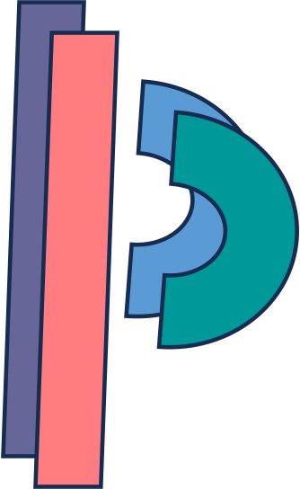

# plumber-pants

**plumber-pants** is a base template and framework to build [`Nextflow`](https://www.nextflow.io/) pipelines.

 If you're already invested in the nf-core ecosystem or looking to fork an existing nf-core pipelines, I highly recommend checking out the amazing [`nf-core tools`](https://nf-co.re/tools/) package instead of plumber-pants. However, if you are looking for a more trimmed back framework to start from, without a lot of the unnecessary files for building institution specific pipelines, then plumber-pants might be a helpful resource. 

It's nothing fancy just a nice clean starting point to work from when making a new pipeline, allowing you in integrate a lot of your own internal modules. Shoutout if you have any suggestions or want to help improve this template. 

## Usage
If you are using **plumber-pants** as the base framework for your new pipeline chances are your don't want or need the git history associated with this repo. To download the latest commits without history run:

`git clone git@github.com:lpembleton/plumber-pants.git --depth 1`

To remove the association with git before you make your own repo:

`rm .git`

## Getting started with your pipeline
To set up your pipeline, simply delete this *README* file and replace it with your own documentation. This will allow you to provide clear instructions, explanations, and details specific to your pipeline.

The folder structure is reasonably self-explanatory:
* conf - store your profile specific config files here ([`more info`](https://www.nextflow.io/docs/latest/config.html#config-profiles))
* docs - add any pipeline specific documentation or example data here
* modules - save your modules here (more info below) ([`more info`](https://www.nextflow.io/docs/latest/dsl2.html?highlight=module#modules))
* workflow - you might just have a single pipeline or multiple. Store them here and reference them from the main.nf file in the base dir ([`more info](https://www.nextflow.io/docs/latest/dsl2.html?highlight=module#workflow))

### Modules
You can run our own module repository and share these across your pipelines using [`git submodules`](https://github.blog/2016-02-01-working-with-submodules/)

To setup your own module repository:
1. Create a GitHub repository such as 'nf-modules'
2. I would also recommend creating a subfolder 'local' so that you can still bring in nf-core modules into another subfolder 'nf-core'
3. Start adding your internal modules

To link your module repository to your pipeline:

4. Firstly you need to remove the current `modules` folder in plumber-pants

    `rm -r modules`

2. Add your global modules repository as a submodule 

    `git submodule add https://github.com/<user>/<nf-modules> modules`

2. If you are running an older version git you may need to run the following to pull down the files

    `git submodule update --init --recursive`

3. Over time to pull in any updates from your modules repository run:

    `git submodule update --recursive`

Note: you can edit modules within your new pipeline and commit them back to your global module repo. Read this [`github blog post`](https://github.blog/2016-02-01-working-with-submodules/) for some points on how to get started with that. 

## Contributions

Contributions to plumber-pants are welcome and encouraged. If you have any ideas, suggestions, or improvements, please feel free to contribute and help enhance this template.

## Credits

plumber-pants was originally written by [`LWPembleton`](https://github.com:lpembleton).

A lot of inspiration and structure was taken from the Nextflow documentation, the fantastic nf-core community and tool package.

> **Nextflow enables reproducible computational workflows.**
> 
> Paolo Di Tommaso, Maria Chatzou, Evan Floden, Pablo Prieto Barja, Emilio Palumbo & Cedric Notredame.
> 
> P. Di Tommaso, et al. Nextflow enables reproducible computational workflows. Nature Biotechnology 35, 316–319 (2017) doi:10.1038/nbt.3820

> **The nf-core framework for community-curated bioinformatics pipelines.**
>
> Philip Ewels, Alexander Peltzer, Sven Fillinger, Harshil Patel, Johannes Alneberg, Andreas Wilm, Maxime Ulysse Garcia, Paolo Di Tommaso & Sven Nahnsen.
>
> _Nat Biotechnol._ 2020 Feb 13. doi: [10.1038/s41587-020-0439-x](https://dx.doi.org/10.1038/s41587-020-0439-x).

Groovy functions that parse a samplesheet for metadata were sourced from the nf-core ([`sarek`](https://github.com/nf-core/sarek/tree/master)) pipeline

> Garcia M, Juhos S, Larsson M et al. 
>
> **Sarek: A portable workflow for whole-genome sequencing analysis of germline and somatic variants [version 2; peer review: 2 approved]** 
>
> _F1000Research_ 2020, 9:63 [doi: 10.12688/f1000research.16665.2](http://dx.doi.org/10.12688/f1000research.16665.2).

## License

This project is licensed under the MIT License - see the LICENSE file for details.
